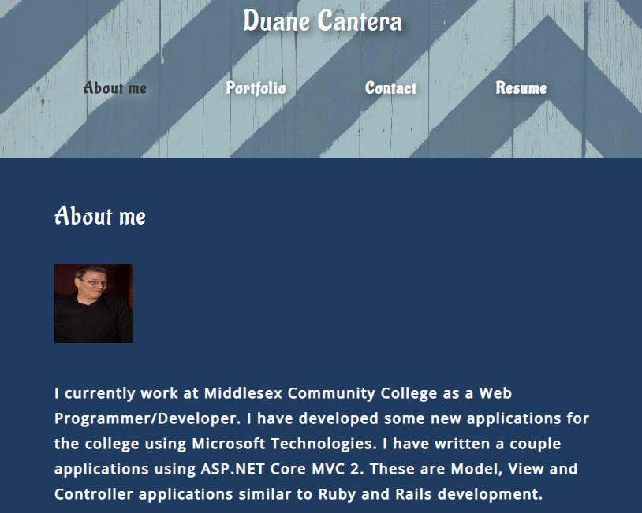
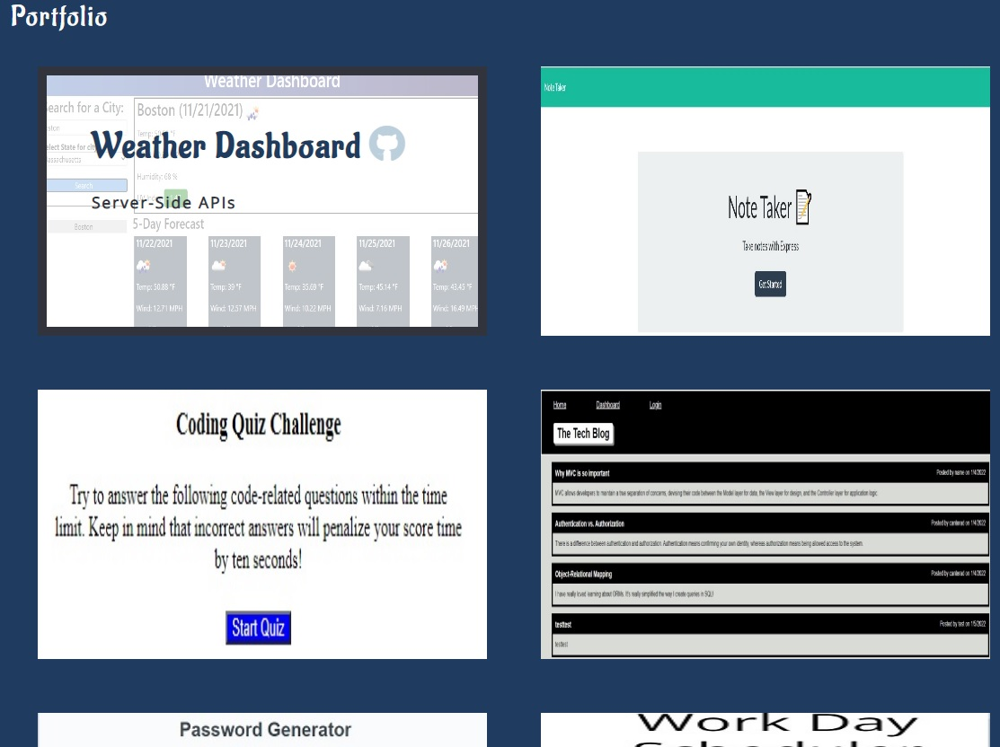
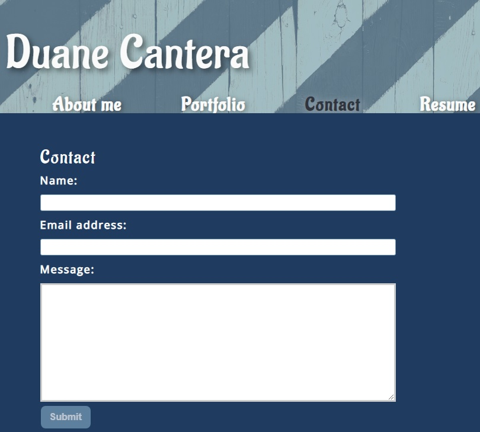
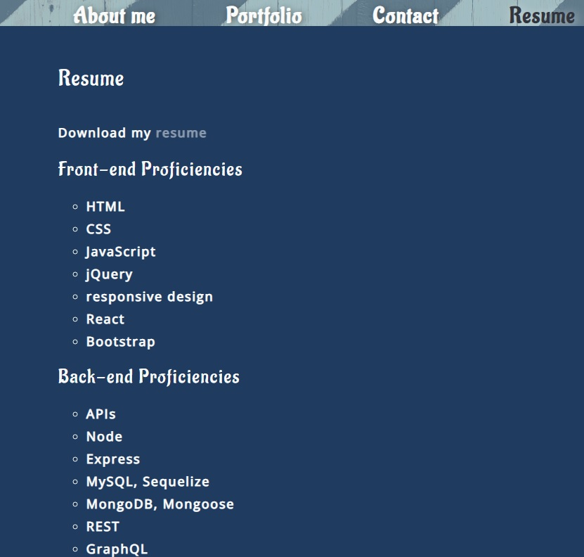

# React Portfolio

React Portofolio Project for UNH Boot Camp # 20 - React. 
This repository was created for the Homework Assignment dealing with React.  

Developer: Duane Cantera 
Date: Feb. 15, 2022 
Assignment: #20 - React: React Portfolio  

This project consisted of creating a portfolio which is a React single web page application.
This web application is deployed on GitHub.    

The main web page consists of a header, content and footer sections.  The header section consists of a navigation bar that contains the titles "About Me", "Portfolio", "Contact" and "Resume".   When the user clicks on a 
navagation title they are presented with the corresponding section below the navigation 
without the page reloading and the selected title is highlighted.  The "About Me" section contains the developer's
photo and a short bio.

 

  

The "Portfolio" section contains six titled images of the developer's applications.  Each one
contains links to both the deployed application and the corresponding GitHub repository.

 

  

The "Contact Form" contains fields for a name, email address and a message.  When the user moves
the cursor out of one of the form fields without entering text the user is notified that the
field is required.  The email address entered is tested and the user is notified if it is invalid.
This application does not include a back end or connect to an API, so the contact form does not save
the information entered.

 

  

The "Resume" section contains a link to a downloadable resume and a list of the developer's 
proficiencies.

 

  

The "Footer" section contains links to the developer's GitHub, LinkedIn and Stack Overflow profiles.  

  

## Technologies Used:
React Components, State, Props, React Hooks and JSX.

## LINKS:

Git Hub Link To Code For Project:  
https://github.com/canterad/React_Portfolio.git

 Link to URL of application deployed on GitHub: 
https://canterad.github.io/React_Portfolio/
